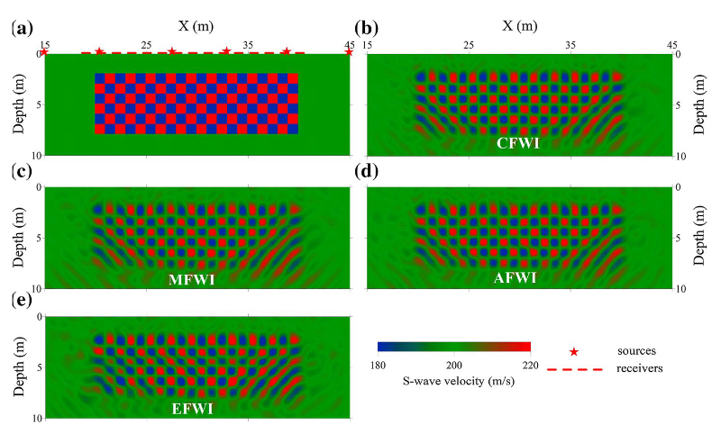

# DW-FWI
Dongwoo's FWI code

This repository aims to implement Full Waveform Inversion (FWI) tailored for near-surface geophysical problems. The inversion framework is developed in PyTorch, leveraging [Deepwave](https://github.com/ar4/deepwave) for elastic wave simulation and using the Adam optimizer for model updates.

## Pan et al., 2019
Reproducing the FWI examples presented in the paper "High-Resolution Characterization of Near-surface Structures by Surface-Wave Inversions".

### 1. Error Maps for FWI Methodologies 🗺️  
These error maps were generated to visually compare the convergence characteristics and nonlinearity of different FWI techniques, such as Classical, Multiscale, and Envelope-based methods.

|              | S-wave velocity (m/s) | P-wave velocity (m/s) | Density (g/cm³) | Thickness (m) |
|--------------|------------------------|------------------------|------------------|----------------|
| Layer 1      | 200                    | 500                    | 2.0              | 6              |
| Half-space   | 400                    | 1000                   | 2.0              | ∞              |

### 2. Checkerboard Test 🏁 
Results from checkerboard modeling and inversion, performed to evaluate the spatial resolution of FWI. This test demonstrates how well FWI can reconstruct complex geological structures.

Initial Model: Vp = 500 m/s, Vs = 200 m/s, Density = 2000 kg/m³

Checkerboard: The model consists of 1m x 1m cells with a ±10% perturbation applied only to the S-wave velocity (Vs), resulting in values of 220 m/s or 180 m/s.

### 3. Additional Tests
This section includes further analysis on the effects of other variables on FWI performance, such as the number of sources and the strength of regularization.

## Liu et al., 2021
Reproducing example simulates a scenario with a shallow-buried obstruction to test its detection via FWI, referencing the paper "Detection of a shallow-buried rock obstruction using 2D full waveform inversion" by Liu et al., 2021.

The simulation includes the following types of subsurface obstructions:  
1. Low-Contrast Obstruction: An object with a seismic velocity similar to the background medium.
2. High-Contrast Obstruction (Rock/Boulder): An object with a significantly higher velocity than the background, such as rock.
3. Void/Cavity: An empty space or cavity within the subsurface.
4. Metallic Pipe: A man-made object, such as a steel pipe.